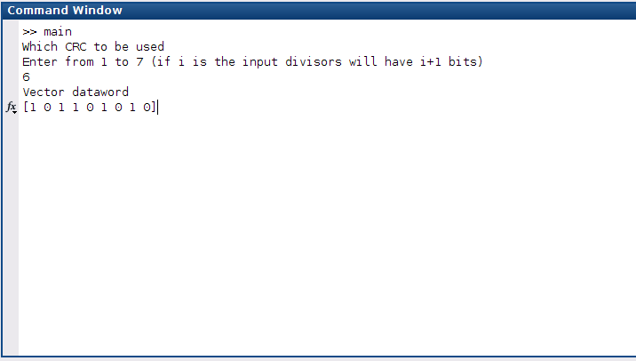
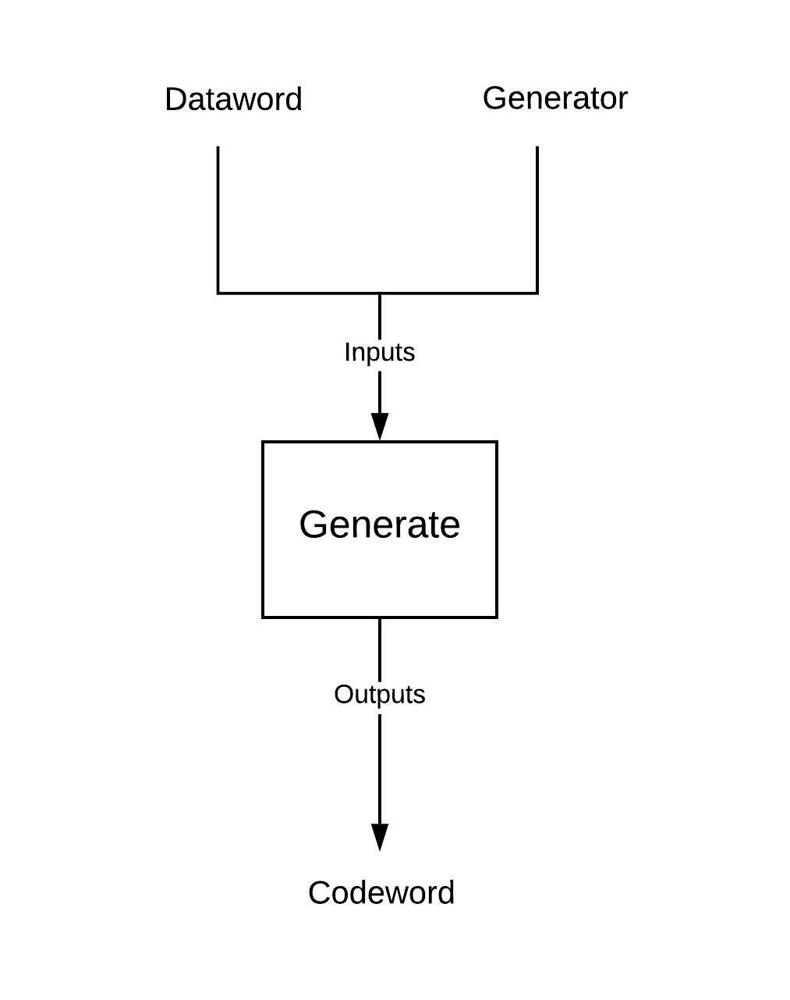
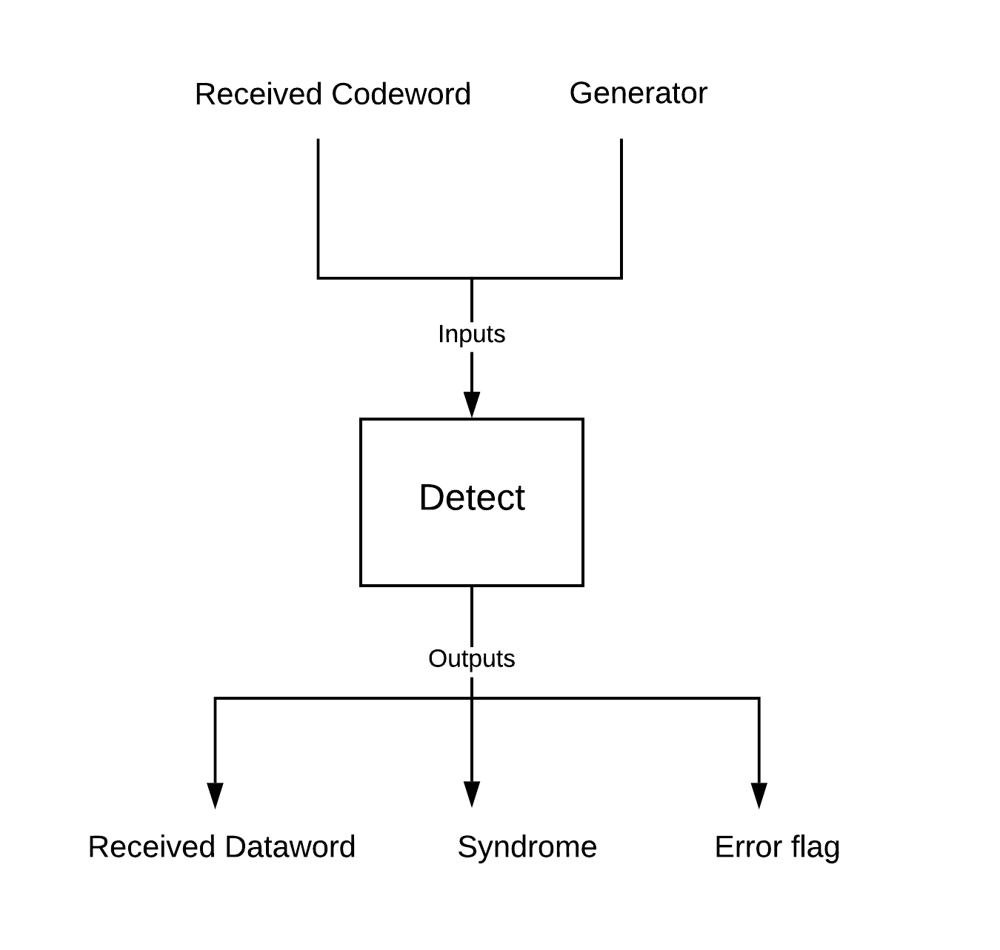

# CRC2 to 7 

What it does
---

For a given dataword and a specified set of CRCN in the main.m, %error detection and correction will be outputted in the bar graph.

File Contents
---

```
main.m

perDetect.m

generate.m

detect.m
```

Inputting
---
Run main.m in MATLAB, input N to select the CRC. E.g. if you want to use CRC4 then input 4. 

Input the dataword vector. E.g. [ 1 1 0 1 0 ]

The following image will provide an idea:



How the program works
---

1. Generate takes dataword and generator as input. The output will be the codeword.It is described in the diagram below.



2. Detect takes received codeword and generator as input. If the received codeword is correct the the output err flag and syndrome will be 0 The output of this function are err, syndrome and reveived codeword.



3. perDetect function also takes in codeword and generator as the parameter. In this a loop runs taking possible all i bit errors i varying from 2 to lenCW. 

For each i, a all combinations of i numbers from 1 to lenCW are chosen which is the matrix A. 
Matrix A has i columns and rows equal to number of combinations possible. In each row the column depicts the location where error must be commited. This is done by inverting the bit. A dummy variable x is generated for each row in A which is initialised to the codeword everytime the loop is run.
So for each row in A the i bit errors are created. This codeword with errors are passed on to the detecter and if the errored codeword is detected then detectedErrors is incremented by 1 and Errors is incremented by 1 else only Errors is incremented by 1.
