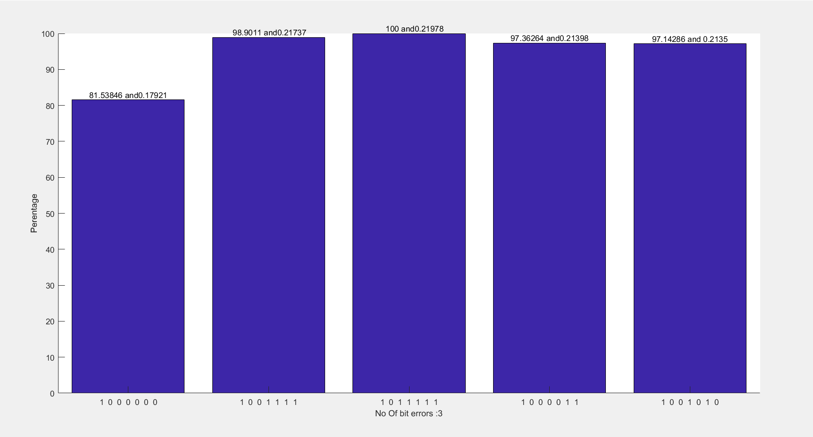

# CRC-2-7 

Members
---
## Ishaan R Dharamdas (16CO117)
## Prajval M (16CO234)

Problem Statement
---

CRC code analysis of % error detection and correction w.r.t input data words for 1, 2, ... n-bit errors and for 2-7-bit divisors.

What it does
---

For a given dataword and a specified set of CRCN in the main.m, %error detection and correction will be outputted in the bar graph.

File Contents
---

```
main.m

perDetect.m

generate.m

detect.m
```

Input
===
Run main.m in MATLAB, input N to select the CRC. E.g. if you want to use CRC4 then input 4. 

Input the dataword vector. E.g. [ 1 1 0 1 0 ]

The following image will provide an idea:


How the program works
---

1. generate.m - takes dataword and generator as input. The output will be the codeword.It is described in the diagram below.


2. detect.m - takes received codeword and generator as input. If the received codeword is correct or the error is untraceable then the output err flag and syndrome will be 0. The outputs of this function are err, syndrome and received codeword.


3. perDetect.m - takes in codeword and generator as the parameters. In this a loop runs taking all possible i bit errors, i varying from 2 to lenCW. 

For each i, all combinations of i numbers from 1 to lenCW are chosen which results in matrix A.
Matrix A has i columns and rows equal to number of combinations possible. In each row the column depicts the location where error must be commited. This is done by inverting the bit. A dummy variable x is generated for each row in A which is initialised to the codeword everytime the loop is run.
So for each row in A the i bit errors are created. This codeword with errors are passed on to the detector and if the errored codeword is detected then detectedErrors is incremented by 1 and Errors is incremented by 1 else only Errors is incremented by 1. The output of this are detectedErrors and Errors. This is shown in the image below


The detectedErrors and Errors are added to the next column of errors and total_error.

The output of perDetect are 3 row matrices, errors depicting detectedErrors, total_error depicting Error and %error correction reperesenting probablity of error correction of 2,3 ... lenCW errors.


In main.m, the dataword and N for CRCN are given as input. This generates all codewords corresponding to each generator from CRCN.
For each generator perDetect is used to find the 2...lenCW bit error err (detected errors), total (total errors) and pro (probablity of error correction). dataT is a 2D matrix representing the %error detection where kth column is for k+1 error bits. Similarly prob is a 2D matrix representing the probability of error correction. They are transposed and each row of transposed matrix is given as input to the bar graph generator as we want to compare k bit errors for all the generators.


OUTPUT
===

The output of the program will be a series of bar graphs. The X coordinate contains the generators and the y coordinate contains % error detection.




